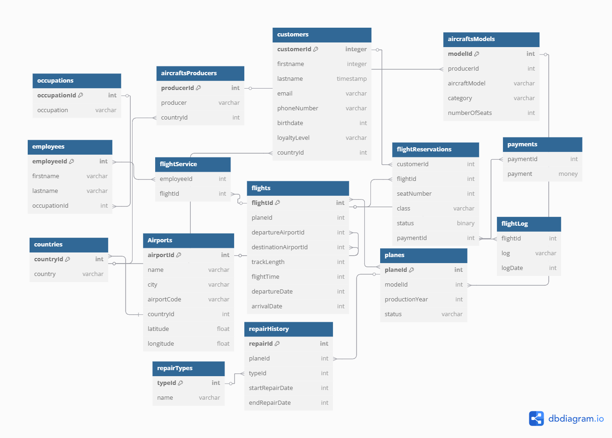

# Analytical-and-Reporting-System-for-an-Airline-Using-SAS-Software

This project was carried out as part of the SAS TOOLS academic course during the winter semester of 2024. The goal of the project was to develop a prototype analytical and reporting system for managing an airline.

As part of the project, the following data model was created:

Additionally, a set of scripts was developed, covering the following functionalities:

A script for generating sample data,
A script for building the data model,
A script for validating data integrity,
A script for adding and modifying data,
A script for generating data summaries and analyses,
A script for preparing visualizations of the summaries/analyses.

The main objective of this project was to apply practical programming skills in SAS software, utilizing the knowledge acquired over two semesters in the Data Processing in SAS and SAS TOOLS courses.
